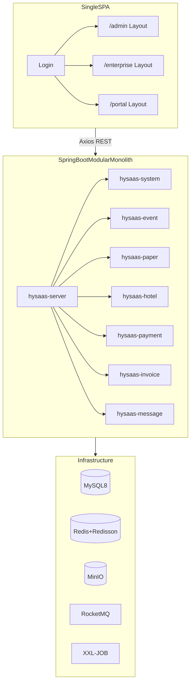
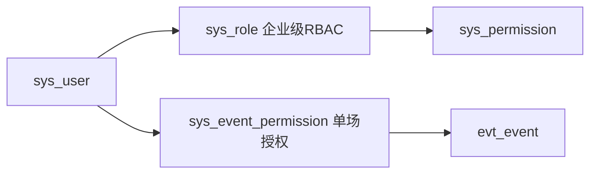
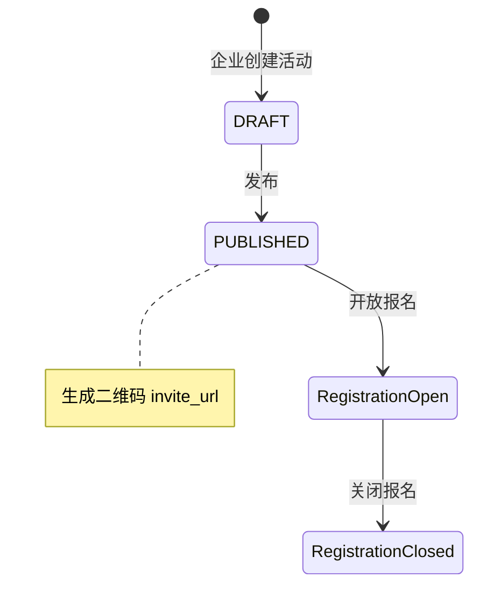
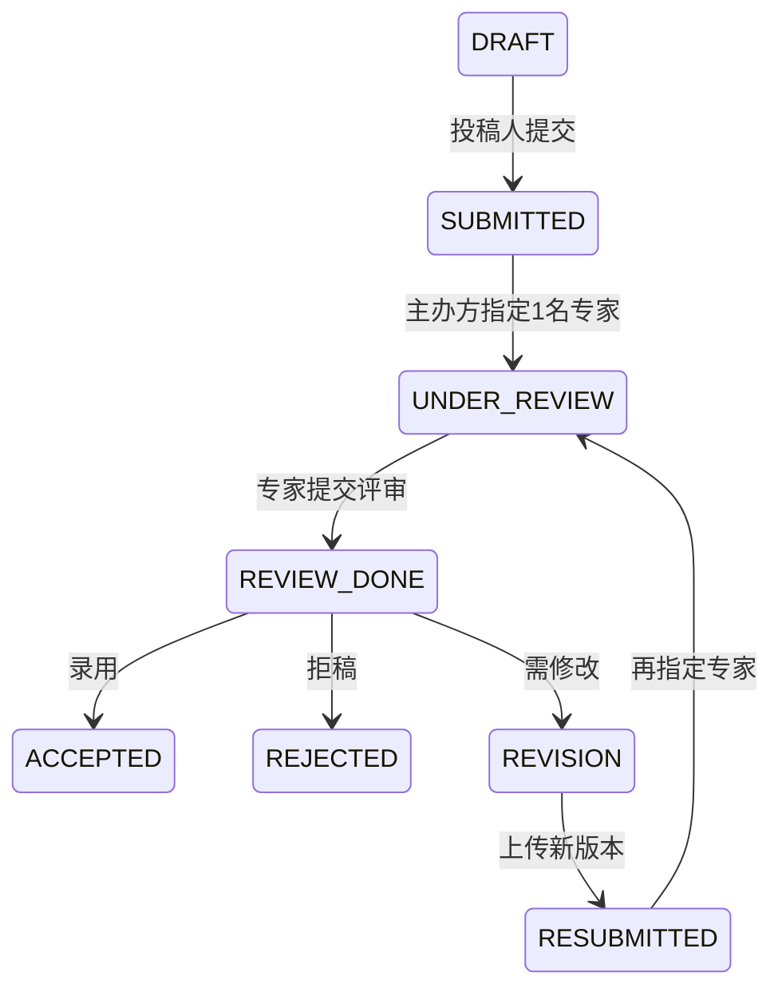
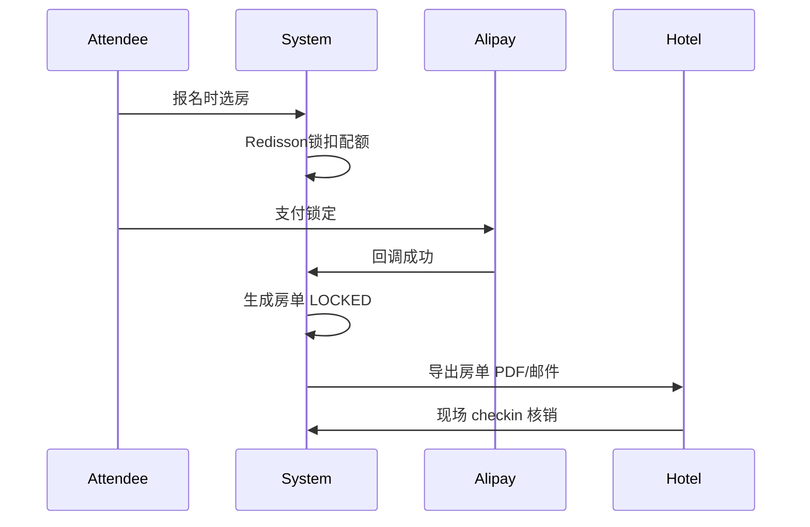
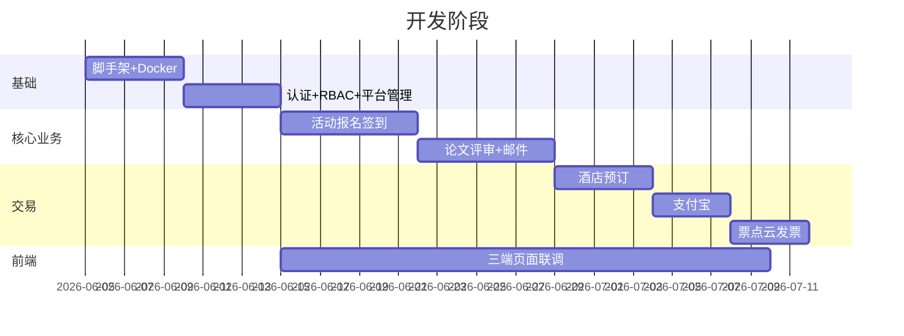

# HySaaS 会议系统全栈开发计划

## 现状（2026-06-23）

首期功能已落地，代码在 `src/main/java`、`frontend/`、`sql/`：

| 模块 | 状态 |
|------|------|
| 认证 / 平台租户用户配置 | 已完成；租户审核通过自动建企业管理员并邮件通知 |
| 活动 / 报名 / 签到 / WebSocket | 已完成 |
| 论文评审 / 邮件模板 | 已完成 |
| 酒店 / 房单 / 支付（支付宝 + mock） | 已完成 |
| 发票 | mock 异步开票 + 邮件链接；票点云真实 API 未接 |
| 单场活动授权 | 表已建，`/auth/me` 返回；管理 API / 前端配置页未做 |
| 前端三端 SPA | 已完成；已移除 API 失败 demo 假数据 |

设计资产：[login.html](login.html)、[DESIGN.md](DESIGN.md)

## 后续规划（Phase 7+）

### 微信支付

- 平台 `/admin/config` 扩展：`wechatMchId`、`wechatAppId`、`wechatApiV3Key`、`wechatCertSerial` 等
- `pay_order` 增加 `pay_channel`（ALIPAY / WECHAT / MOCK）
- 新增 `WechatPayService`：JSAPI（微信内）、Native（扫码）、H5；回调 `POST /pay/wechat/notify`
- 前端 `launchPay` 按环境选择渠道；订单页展示微信支付入口

### 微信发票助手

- 与票点云并列的第二开票通道，或逐步替代票点云
- 平台配置：微信发票助手商户号、授权信息
- 参会申请发票时可选开票渠道；回调落库 `inv_invoice.channel=WECHAT`
- 支持微信卡包领取；企业端 / 参会端发票下载

### 票点云补齐

- `InvoiceService` 真实调用票点云 API（替换 `mockIssue`）
- 企业端 `FinanceInvoicesView` 下载按钮联调 `fileUrl`

详细契约见 [payment.md](docs/features/payment.md)、[invoice.md](docs/features/invoice.md)。

## 架构总览



## 工程结构

### 后端 Maven 多模块（JDK 21 + Spring Boot 3.3）

```
hySaaS/
├── pom.xml                          # parent BOM
├── hysaas-common/                   # R<T>、BizException、常量、工具
├── hysaas-framework/                # Sa-Token、MyBatis-Plus、Redis/Redisson、MinIO、全局异常
├── hysaas-system/                   # 租户、用户、RBAC、平台配置
├── hysaas-event/                    # 活动、报名、审核、签到、二维码
├── hysaas-paper/                    # 投稿、评审、状态机
├── hysaas-hotel/                    # 酒店协议、房型配额、房单
├── hysaas-payment/                  # 支付宝下单/回调
├── hysaas-invoice/                  # 票点云开票/回调
├── hysaas-message/                  # SMTP 邮件、RocketMQ 异步、WebSocket 通知
├── hysaas-server/                   # 启动入口，聚合所有模块
└── sql/
    └── V1__init.sql                 # 全量 DDL + 种子数据
```

关键依赖版本建议：Spring Boot 3.3.x、Sa-Token 1.39+、MyBatis-Plus 3.5.7+、Knife4j 4.x（OpenAPI3）、Redisson 3.3x、XXL-JOB 2.4.x。

### 前端单 SPA（Vue3 + Vite + TS）

```
hySaaS/frontend/
├── src/
│   ├── router/
│   │   ├── index.ts                 # 路由守卫 + 角色分流
│   │   ├── admin.ts                 # /admin/*
│   │   ├── enterprise.ts            # /enterprise/*
│   │   └── portal.ts                # /portal/*
│   ├── layouts/Admin|Enterprise|PortalLayout.vue
│   ├── stores/auth.ts, tenant.ts, event.ts
│   ├── api/                         # 按模块拆分 axios 封装
│   ├── styles/tokens.css            # 从 DESIGN.md 迁移 OKLCH 变量
│   └── views/
│       ├── login/                   # 移植 login.html
│       ├── admin/                   # 租户审核、全局配置
│       ├── enterprise/              # 活动/论文/酒店/邮件/财务
│       └── portal/                  # 报名/投稿/支付/签到/订酒店
```

Element Plus 主题覆盖 `--el-color-primary` 为 DESIGN.md 钴蓝；登录页复用现有 split-panel 布局。

---

## 账号与权限模型

三类账号，登录后按 `userType` 跳转：

| userType | 路由前缀 | 能力 |
|----------|----------|------|
| PLATFORM | `/admin` | 租户审核、全局 SMTP/支付/发票配置 |
| ENTERPRISE | `/enterprise` | 企业 RBAC + 单场活动授权 |
| ATTENDEE | `/portal` | 报名、投稿、支付、签到、订酒店 |



- Sa-Token：`StpUtil.login(userId)` + `@SaCheckRole` / 自定义 `@SaCheckEventPerm`
- 企业内角色：管理员、会务、财务、专家（评审用）
- 单场活动授权：`event_id + user_id + perm_code`（如 `EVENT_MANAGE`、`EVENT_REVIEW_ASSIGN`）
- 专家仅能看到被分配的稿件，不做重型会控权限

核心表：`sys_tenant`、`sys_user`、`sys_role`、`sys_permission`、`sys_user_role`、`sys_role_permission`、`sys_event_permission`。

---

## 模块一：基础设施（Phase 0）

**后端**

- [hysaas-framework](d:\java\xm\2026_06\hySaaS\hysaas-framework) 统一配置：
  - 全局 `R<T>` 响应、`GlobalExceptionHandler`
  - MyBatis-Plus 分页 + 逻辑删除 + `tenant_id` 自动填充
  - Redis 缓存 + Redisson 分布式锁（支付回调、配额扣减）
  - MinIO 文件上传（论文 PDF、活动物料）
  - Knife4j `/doc.html`
  - RocketMQ Producer/Consumer 骨架
  - XXL-JOB 执行器注册（对账、超时订单关闭）
  - WebSocket 端点（签到实时计数、通知）

- [sql/V1__init.sql](d:\java\xm\2026_06\hySaaS\sql\V1__init.sql) 全量 DDL

**前端**

- `npm create vite` 初始化 + Element Plus + Pinia + Vue Router
- Axios 拦截器：Token 注入、401 跳登录、统一错误 toast
- 路由守卫：`meta.roles` + `meta.eventPerm` 校验

**Docker Compose（本地开发）**

`docker-compose.yml`：MySQL 8、Redis、MinIO、RocketMQ（可选 XXL-JOB admin）。

---

## 模块二：认证与平台管理（Phase 1）

**API**

| 接口 | 说明 |
|------|------|
| `POST /api/auth/login` | 账号密码登录，返回 token + userType |
| `POST /api/auth/logout` | 登出 |
| `GET /api/auth/me` | 当前用户 + 角色 + 活动权限 |
| `GET/PUT /api/admin/tenants` | 平台：租户列表/审核 |
| `GET/PUT /api/admin/config` | 平台：全局配置（SMTP、支付宝、票点云密钥） |

**前端页面**

- 登录页（移植 [login.html](d:\java\xm\2026_06\hySaaS\login.html)）
- `/admin/tenants` 租户审核
- `/admin/config` 全局配置表单

---

## 模块三：活动核心链路（Phase 2）



**数据模型**

- `evt_event` — 活动基本信息、时间地点、报名开关、酒店/论文开关
- `evt_registration` — 报名记录（PENDING/APPROVED/REJECTED）
- `evt_checkin` — 签到记录（扫码/手动）
- `evt_qrcode` — 活动二维码、邀请链接 token

**API（企业端 `/api/enterprise/events/*`）**

- CRUD 活动、发布/关闭报名
- 生成二维码（ZXing → PNG 存 MinIO → 返回 URL）
- 邀请链接管理
- 报名列表 + 审核（通过/拒绝 → 触发邮件）
- 签到管理 + WebSocket 推送签到人数

**API（门户 `/api/portal/*`）**

- 活动详情（公开/邀请 token）
- 提交报名
- 扫码签到 `POST /api/portal/checkin/{eventId}`

**邮件（状态变更即发）**

- 模板表 `msg_email_template`（event_id 可覆盖企业默认）
- 字符串替换：`{{name}}`、`{{eventName}}`、`{{status}}`
- 报名审核通过/拒绝 → [hysaas-message](d:\java\xm\2026_06\hySaaS\hysaas-message) 异步发信（RocketMQ）

---

## 模块四：论文评审（Phase 3）

**状态机（严格枚举）**

```
DRAFT → SUBMITTED → UNDER_REVIEW → REVIEW_DONE
  → ACCEPTED | REJECTED | REVISION
REVISION → (重投) RESUBMITTED → UNDER_REVIEW（循环）
```



**数据模型**

- `paper_submission` — 稿件、版本号、文件 MinIO key、status
- `paper_review` — 专家 comment + suggest(accept/reject/revision)
- `paper_review_assignment` — 主办方分配记录（每次1专家）

**API**

| 角色 | 接口 |
|------|------|
| 投稿人 | 保存草稿、提交、重投上传 |
| 主办方 | 稿件列表、分配专家、录用/拒稿/需修改 |
| 专家 | 待审列表、提交评审意见 |

**邮件触发点**：SUBMITTED、UNDER_REVIEW、ACCEPTED、REJECTED、REVISION

**前端**

- `/enterprise/papers` — 稿件管理 + 分配专家 + 终审
- `/portal/submissions` — 我的投稿
- `/enterprise/reviews` — 专家工作台（仅被分配稿件）

---

## 模块五：酒店对接（Phase 4）

**业务规则**

- 活动级开关 + 权限：`理事会成员`、`付费会员` 才可预订（报名字段 `member_type` 校验）
- 协议维护：酒店 → 房型 → 配额 → 协议价

**数据模型**

- `hotel_info`、`hotel_room_type`、`hotel_quota`（event_id + room_type_id + total/used）
- `hotel_booking` — 房单（PENDING_PAY/LOCKED/CHECKED_IN/CANCELLED）

**流程**



**API**

- 企业：`/api/enterprise/hotels/*` 维护酒店协议
- 门户：`/api/portal/hotels/{eventId}` 可选房型 + 下单
- 企业：`/api/enterprise/bookings` 房单列表 + 核销

---

## 模块六：支付宝支付（Phase 5）

**数据模型**

- `pay_order` — 业务单（报名费等 `BIZ_TYPE=REGISTRATION/HOTEL`）
- `pay_transaction` — 支付宝流水

**流程**

1. `POST /api/portal/pay/create` → 调支付宝 precreate/page pay → 返回 payUrl
2. 异步通知 `/api/pay/alipay/notify` → Redisson 锁幂等 → 更新订单 + 触发下游（房单锁定/报名确认）
3. XXL-JOB 定时关闭超时未支付订单 + 释放配额

配置项存 `sys_config`（平台级）或 `tenant_config`（租户级覆盖）。

---

## 模块七：票点云发票（Phase 6）

**流程**

1. 支付成功 → 用户 `POST /api/portal/invoices/apply`
2. 调票点云 API 开票
3. 回调 `/api/invoice/callback` → 落库 `inv_invoice`
4. SMTP 发 PDF/OFD 下载链接

**数据模型**

- `inv_invoice` — 发票抬头、税号、金额、status、file_url

---

## 模块八：邮件模板管理（贯穿 Phase 3+）

企业端 `/enterprise/email-templates`：

| 模板 code | 触发时机 |
|-----------|----------|
| PAPER_SUBMITTED | 投稿提交 |
| PAPER_UNDER_REVIEW | 进入评审 |
| PAPER_ACCEPTED | 录用 |
| PAPER_REJECTED | 拒稿 |
| PAPER_REVISION | 需修改 |
| REG_APPROVED / REG_REJECTED | 报名审核 |
| PAY_SUCCESS | 支付成功 |
| INVOICE_READY | 发票就绪 |

实现：`EmailTemplateService.render(code, vars)` → `JavaMailSender` 发送；失败入 RocketMQ 重试队列。

---

## 前端路由规划

```
/login
/admin/dashboard
/admin/tenants
/admin/config
/enterprise/dashboard
/enterprise/events
/enterprise/events/:id/registrations
/enterprise/events/:id/checkin
/enterprise/papers
/enterprise/reviews
/enterprise/hotels
/enterprise/email-templates
/enterprise/finance/orders
/enterprise/finance/invoices
/portal/events
/portal/events/:id/register
/portal/submissions
/portal/orders
/portal/checkin/:eventId
/portal/hotels/:eventId
```

路由守卫逻辑：

```typescript
// 伪代码
if (!token) return '/login'
if (to.path.startsWith('/admin') && userType !== 'PLATFORM') redirect
if (to.path.startsWith('/enterprise') && userType !== 'ENTERPRISE') redirect
if (to.path.startsWith('/portal') && userType !== 'ATTENDEE') redirect
```

---

## 开发顺序与依赖



后端按 Phase 0→6 顺序推进；前端从 Phase 1 起并行，每完成一个 API 模块即联调对应页面。

---

## 关键设计决策

1. **多租户**：所有业务表带 `tenant_id`，MyBatis-Plus `TenantLineInnerInterceptor` 自动隔离
2. **文件存储**：论文/发票/二维码统一 MinIO，DB 只存 objectKey
3. **状态变更邮件**：各 Service 在事务提交后 `@TransactionalEventListener` 发 MQ，避免事务内发信
4. **支付/发票回调**：Redisson 锁 + 幂等表，防止重复处理
5. **酒店配额**：Redisson `RLock` + 乐观扣减，支付超时 JOB 释放
6. **不做 Thymeleaf**：邮件正文用 DB 模板 + `String.replace`，第一期足够

---

## 首期联调检查清单

- 三端账号各能登录并进入对应 Layout
- 企业发布活动 → 二维码可扫 → 参会人报名 → 审核 → 收到邮件 → 现场签到
- 论文全流程跑通（含 REVISION 循环）+ 5 种邮件
- 理事会/付费会员可订酒店，支付后房单生成，核销成功
- 支付宝沙箱支付 + 申请开票 + mock 回调 + 邮件收链接
- （待接）微信支付、微信发票助手、票点云真实 API
